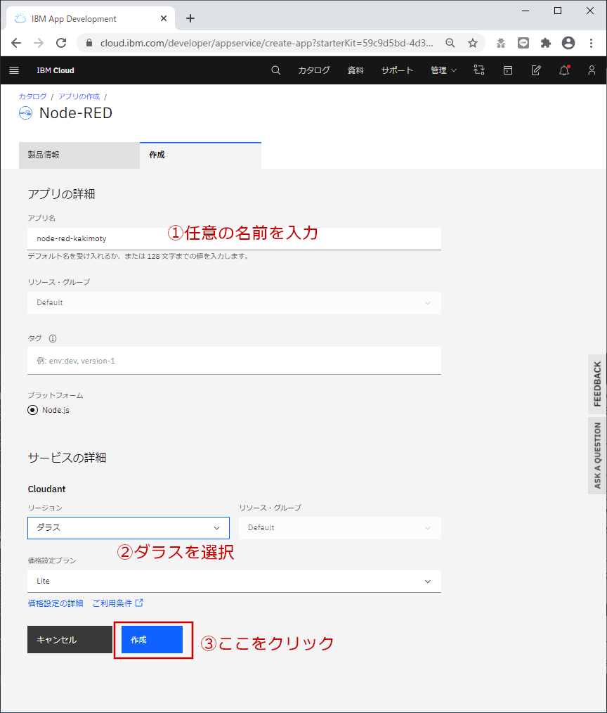
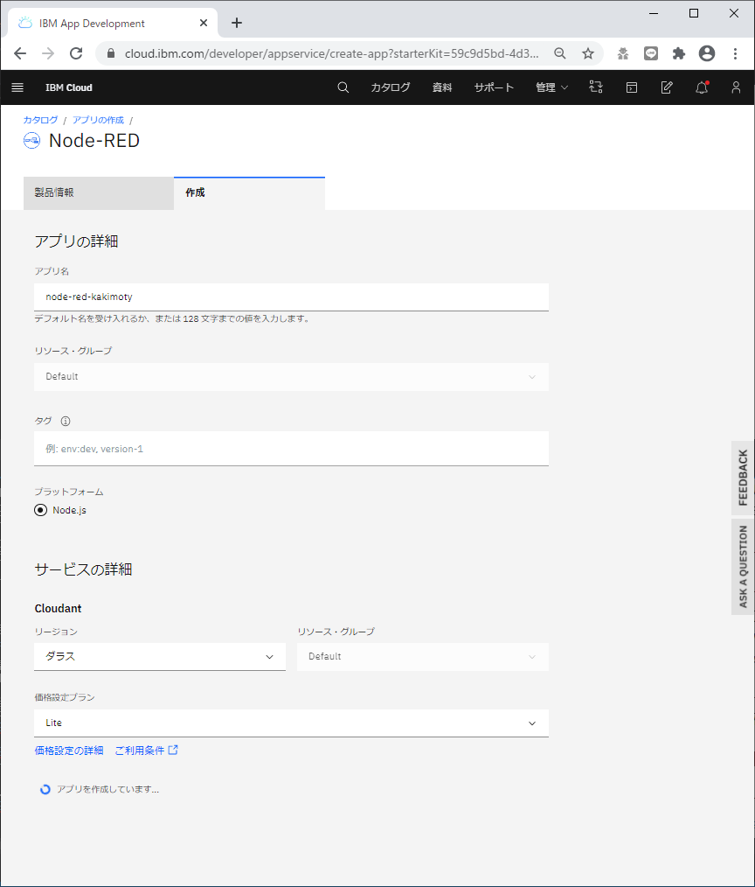
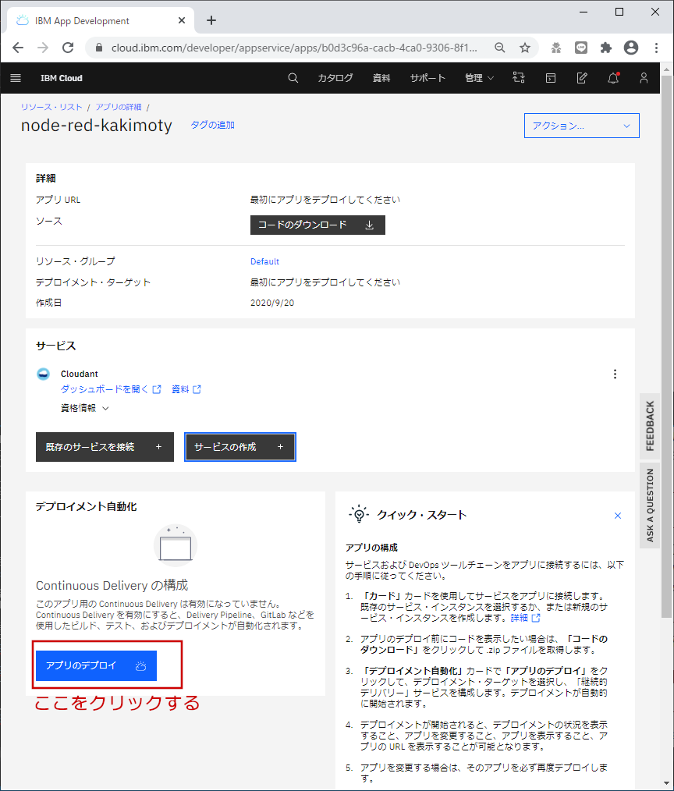
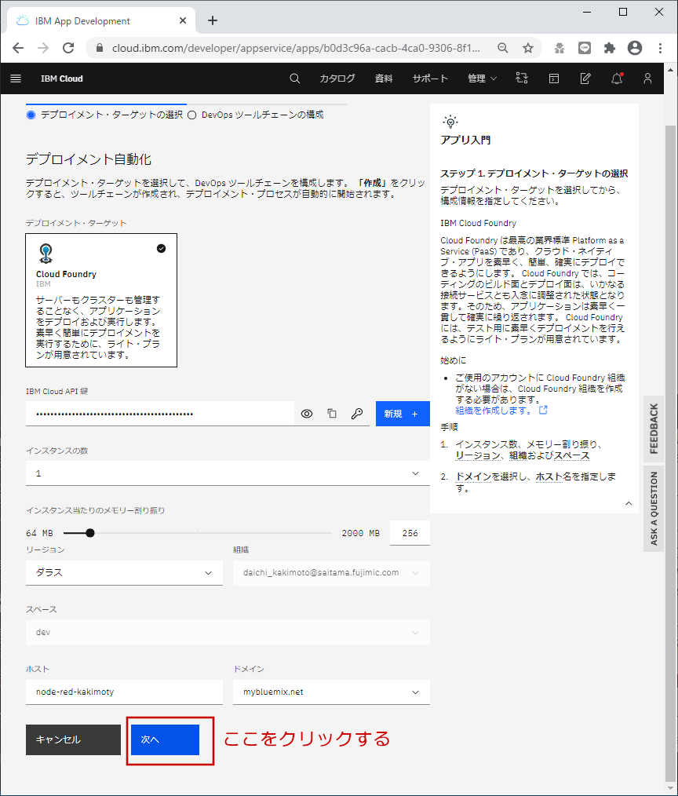
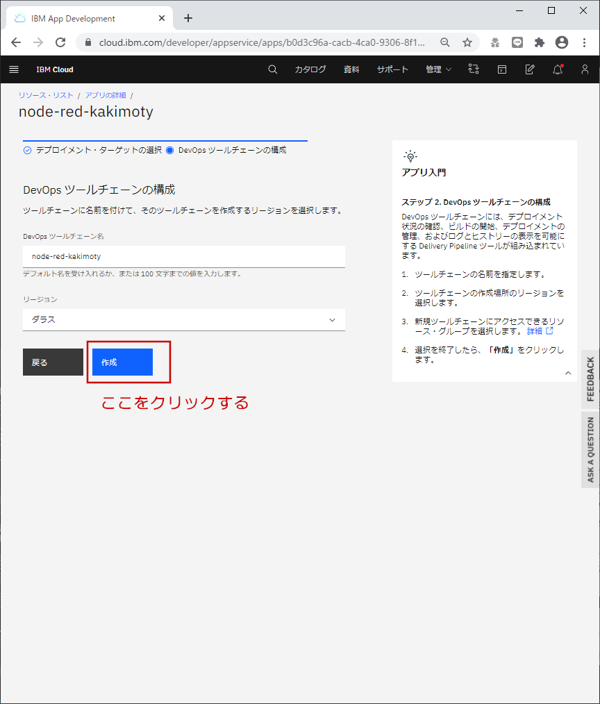
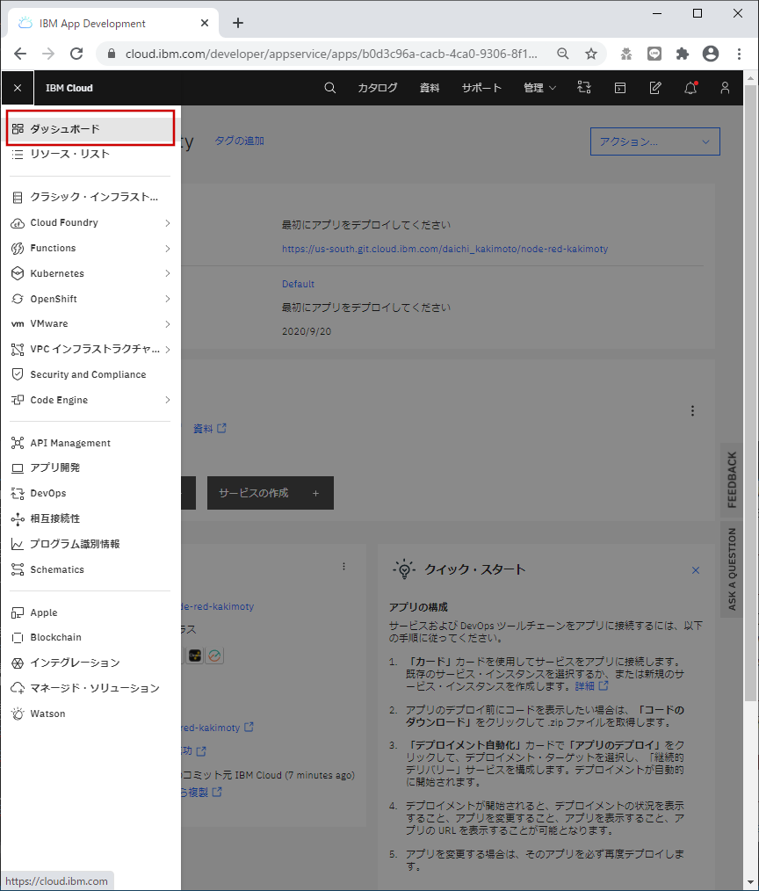
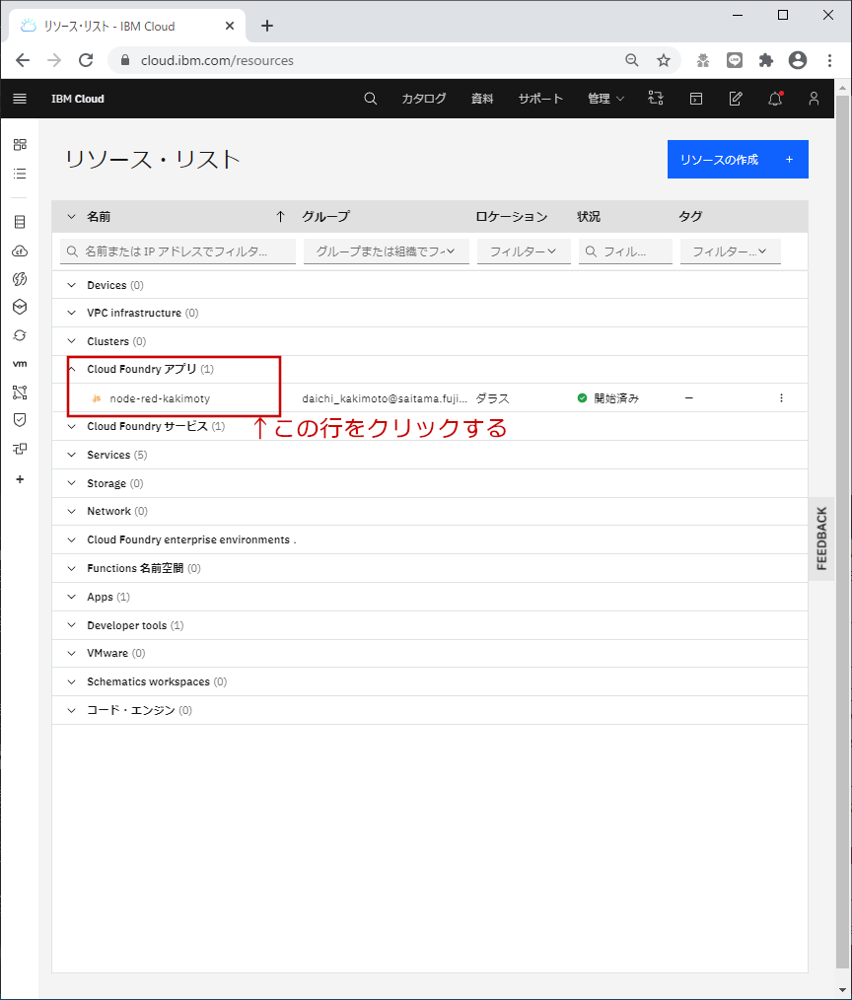
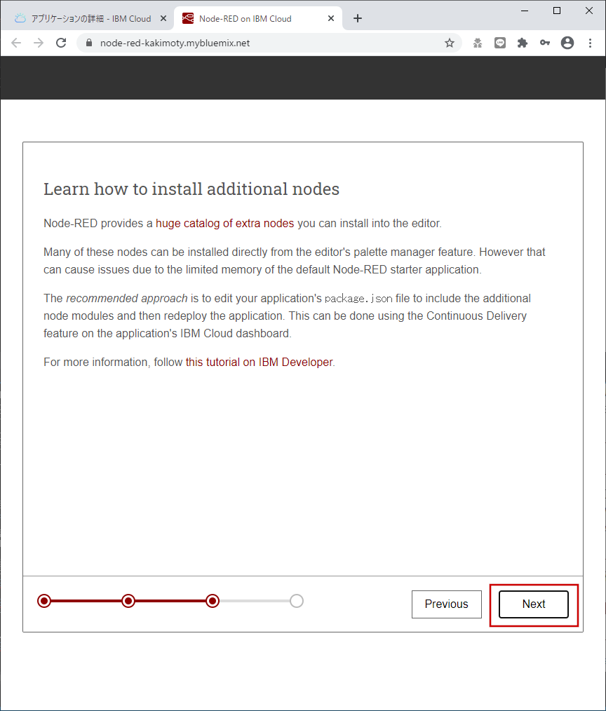
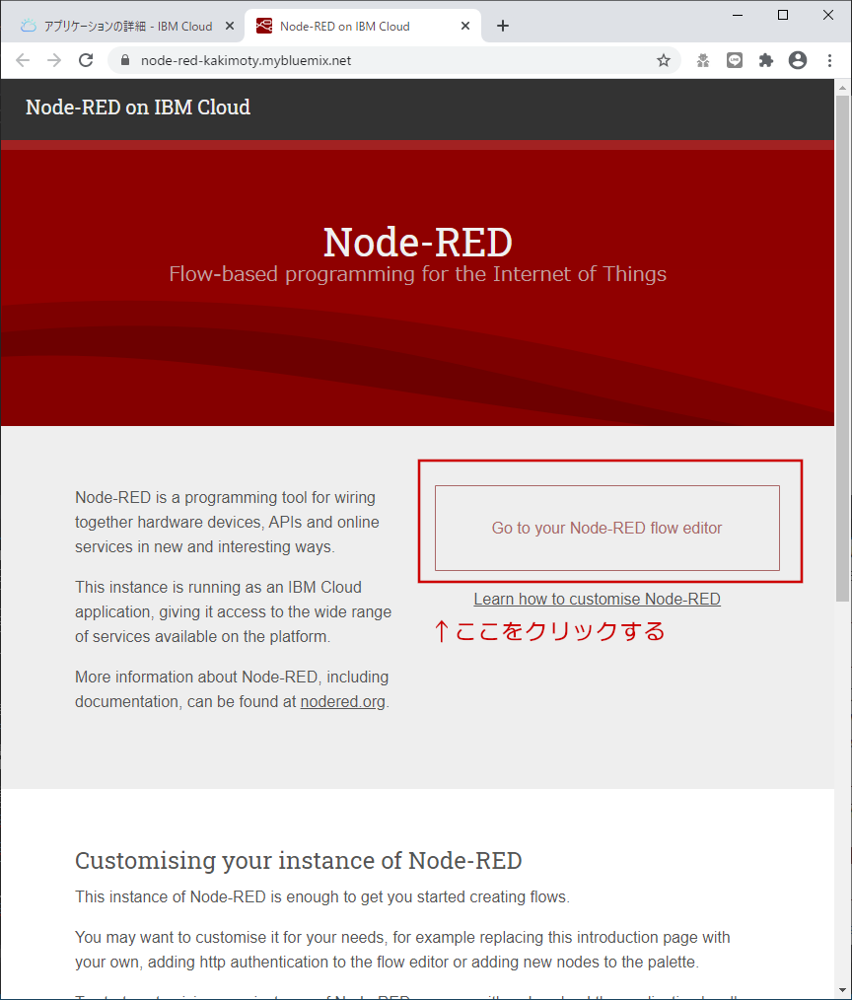
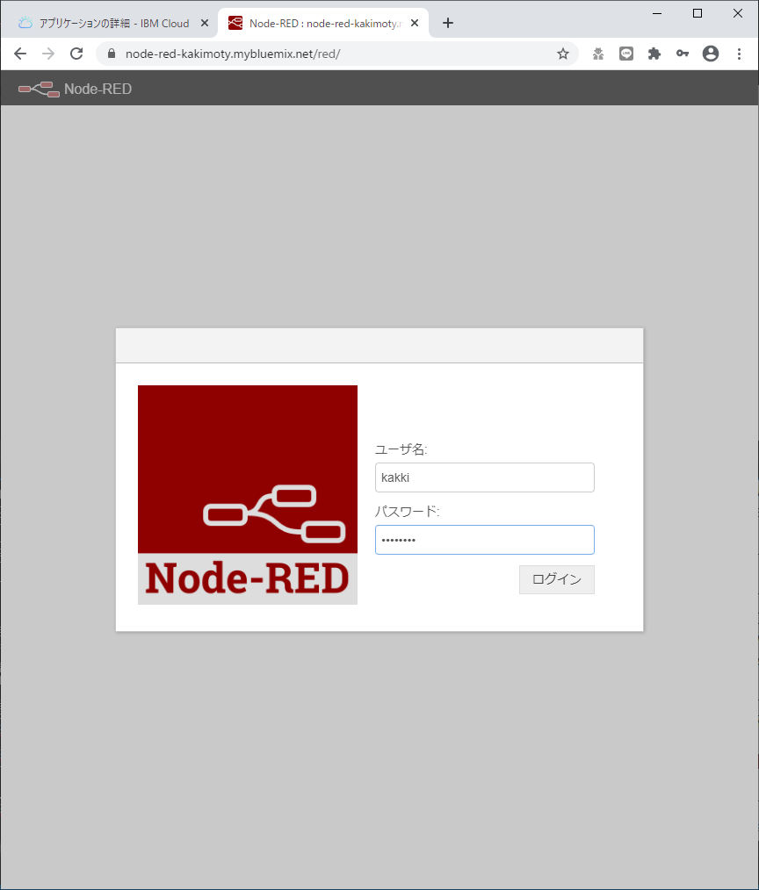

<!-- Table of Contents -->
- [はじめに](#はじめに)
- [開発・実行環境準備](#開発実行環境準備)
    - [Node-RED 用リソース追加](#Node-RED-用リソース追加)
        - [IBM Cloud にログイン](#IBM-Cloud-にログイン)
        - [Node-RED App の検索](#Node-RED-App-の検索)
        - [アプリの作成](#アプリの作成)
        - [IBM Cloud API 鍵設定](#IBM-Cloud-API-鍵設定)
    - [Node-RED デプロイ](#Node-RED-デプロイ)
        - [アプリのデプロイ](#アプリのデプロイ)
- [Node-RED 設定](#Node-RED-設定)
    - [URLアクセス](#URLアクセス)    
    - [セットアップ](#セットアップ)
- [Node-RED 実行](#Node-RED-実行)
    - [トップ画面](#トップ画面)
    - [ログイン](#ログイン)
    - [フローエディター](#フローエディター)
<!-- Table of Contents -->
## 初めに

このドキュメントは IBM Cloud に、Node-RED の実行環境を準備するための手順です。 
ここに記載されている手順は、２０２０年９月のものです。

## 開発・実行環境準備
### Node-RED 用リソース追加
#### IBM Cloud にログイン

ログイン画面でユーザパスワードを入力すると「ダッシュボード」が表示されます。 
「リソースの追加」ボタンをクリックし、カタログ画面を表示します。

#### Node-RED App の検索

[カタログを検索...] と表示されているエリアに `node-red` と入力します。すると、`Node-RED App` の候補が表示されるのでクリックします。

#### アプリの作成

Node-RED アプリの作成画面が表示されます。内容を確認したうえで、画面上部「作成」タブをクリックします

Node-RED アプリを設定します。「アプリ名」の欄には任意のアプリケーション名を入力します。＜サービス詳細＞の「リージョンは「ダラス」を選択します。設定が終ったら「作成」ボタンをクリックします。

アプリ作成が完了するまで１分ほど待ちます

### Node-RED デプロイ

#### アプリのデプロイ

アプリの作成が完了すると、「アプリの詳細」画面に切り替わります。画面下部の「アプリのデプロイ」ボタンがクリックできるようになるまで、２～３分ほど待ちます

「アプリのデプロイ」ボタンが有効になったら、クリックします。

#### IBM Cloud API 鍵設定

＜デプロイメント自動化画面＞で `IBM Cloud API 鍵` を設定します。入力欄の右にある「新規＋」ボタンをクリックします。

＜API 鍵作成のダイアログ＞が表示されるので、`OK` ボタンをクリックし API 鍵を作成します。

＜デプロイメント自動化画面＞に戻るので、画面最下部の「次へ」ボタンが有効になるのを待ってからクリックします。

＜DevOpps ツールチェーンの構成＞画面で、画面下部の「作成」ボタンをクリックします。

＜アプリの詳細＞画面に戻るので、画面下部「デプロイメント自動化」の <状況ステータス>が **成功** になるまで、５分ほど待ちます。

## Node-RED 設定

#### URLアクセス

Node-RED の準備が整っているので、画面左上の「ハンバーガーメニュ」から `ダッシュボード` を選択します。

＜ダッシュボード＞で、`Cloud Foundry アプリ` をクリックします。

＜リソース・リスト＞画面で、Node-RED のアプリを選択します。

Cloud Foundry アプリ 詳細画面で、画面上にある `アプリURLにアクセス` をクリックします。

#### セットアップ

Node-RED アプリが別ウインドウ（別タブ）で表示されます。画面下部の「Next」ボタンをクリックします。

Node-RED にログインするための、ユーザ名とパスワードを設定します。ユーザ認証無しで利用することも可能ですが、だれもがプログラムフローを編集できる状態になってしまうので、ユーザパスワードを設定することをオススメします。

ノードの追加について説明が表示されるので、画面下部の「Next」ボタンをクリックします。

Node-RED のセットアップ完了と、ユーザパスワードの変更に関する説明が表示されます。内容を確認したうえで画面下部の「Finish」ボタンをクリックします。

## Node-RED 実行

#### トップ画面
しばらく待つと Node-RED のトップ画面が表示されます。「Go to your Node-RED flow Editor」ボタンをクリックします。

#### ログイン
2ode-RED のログイン画面が表示されるので、セットアップ時に設定したユーザパスワードを入力し、「ログイン」ボタンをクリックします。

#### フローエディター
Node-RED フローエディターが表示されます。Node-RED のステキな世界をお楽しみくださいっ！

