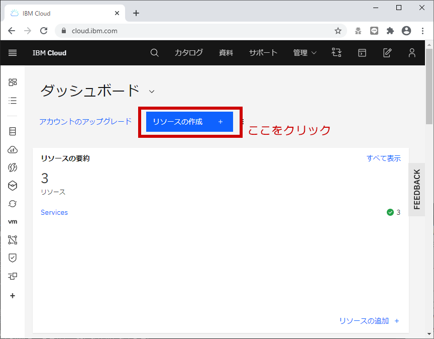
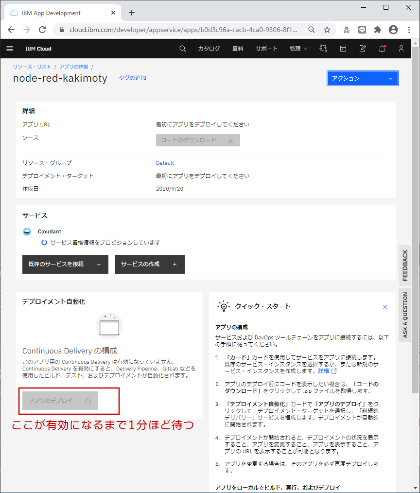
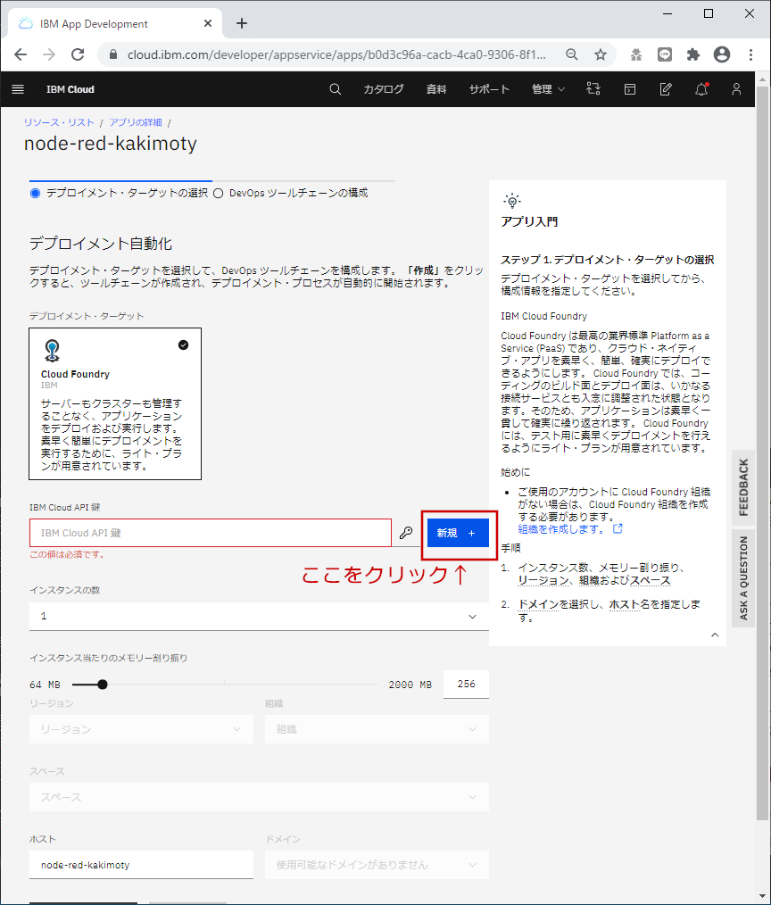
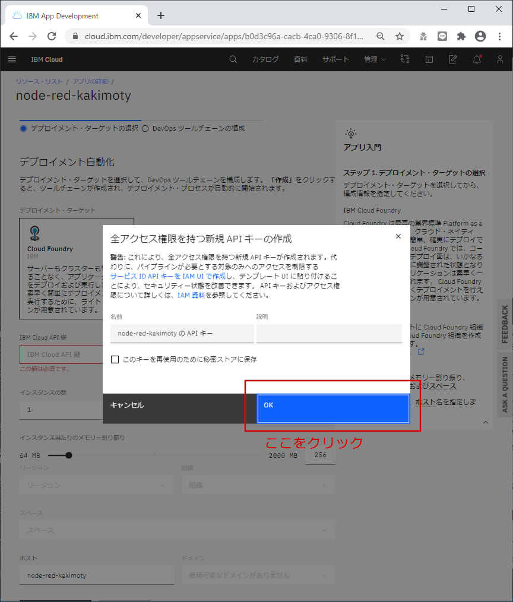
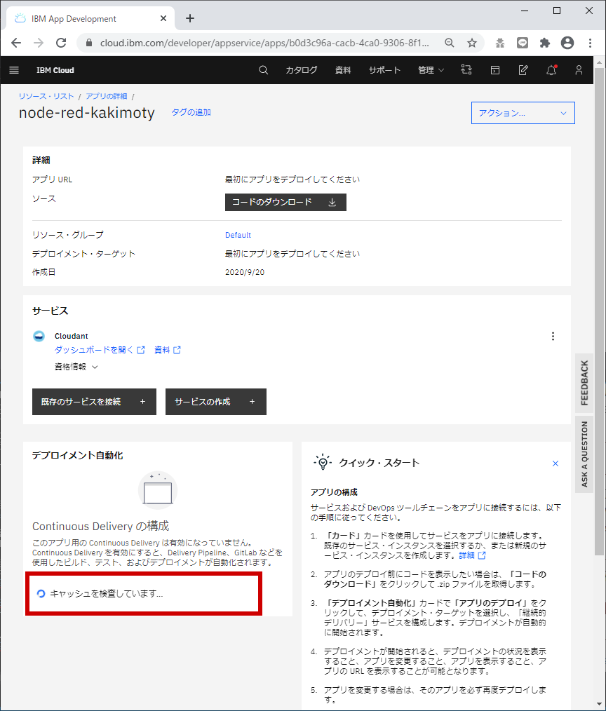
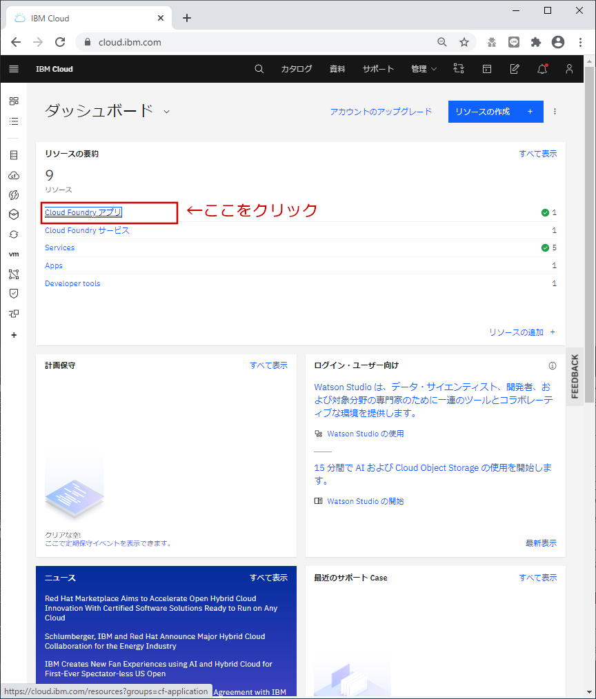
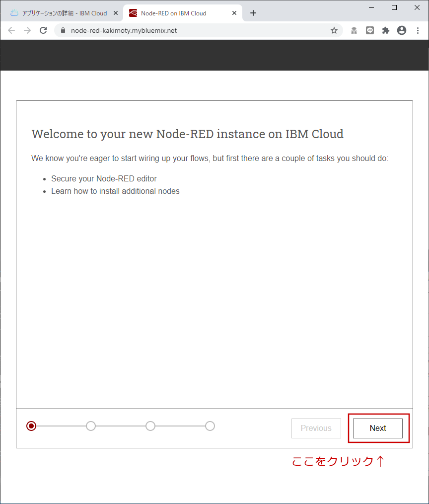
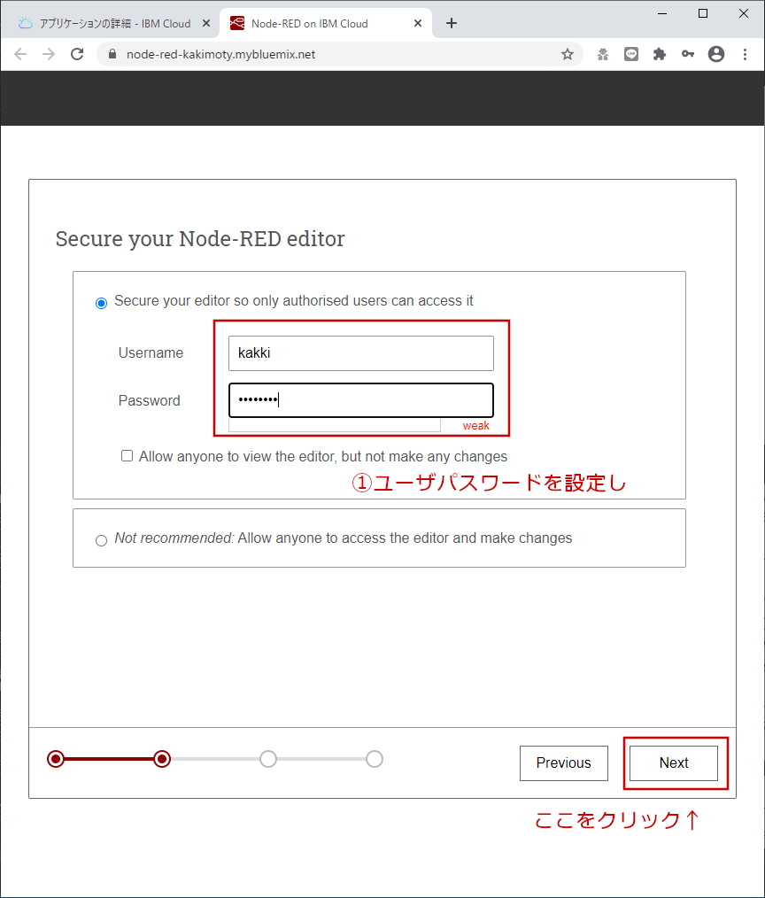
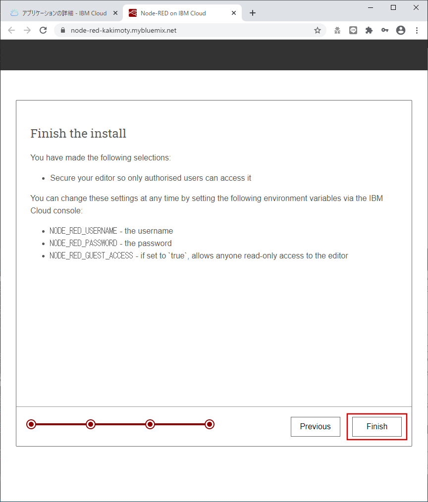
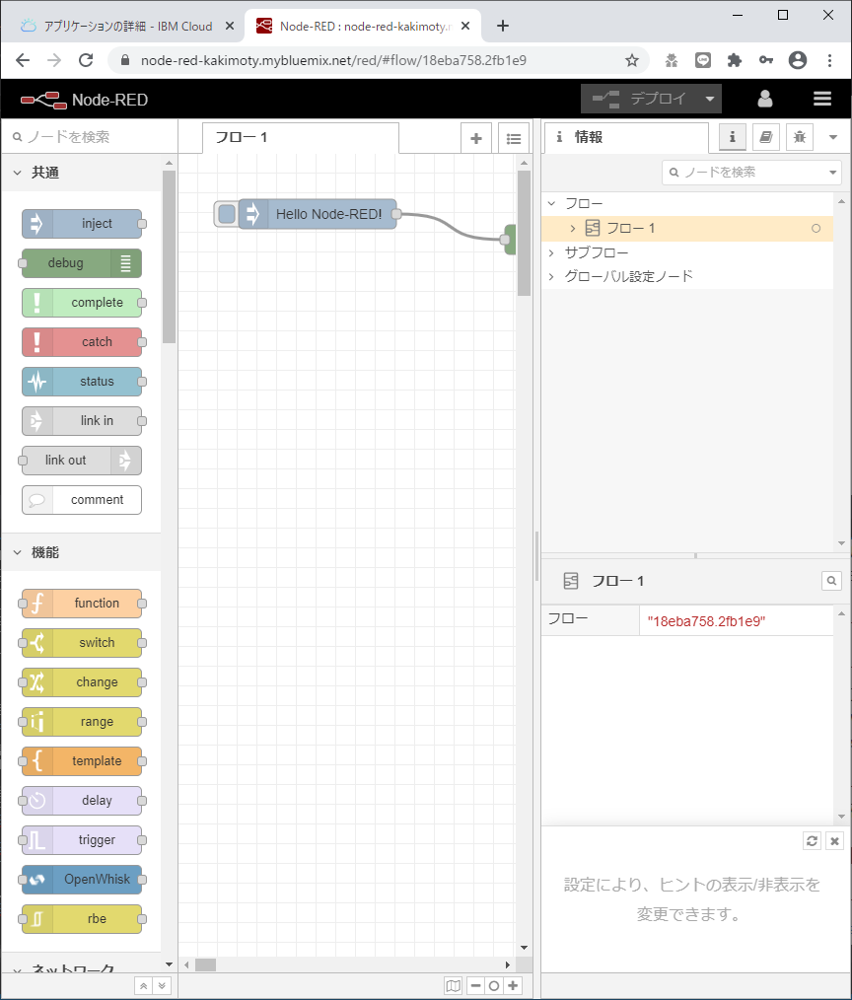

<!-- Table of Contents -->

<!-- Table of Contents -->

## 開発・実行環境準備
1. IBM Cloud にログインします。 
ログイン画面でユーザパスワードを入力すると「ダッシュボード」が表示されます。  
「リソースの追加」ボタンをクリックし、カタログ画面を表示します。

2. Node-RED App の検索  
[カタログを検索...] と表示されているエリアに `node-red` と入力します。すると、`Node-RED App` の候補が表示されるのでクリックします。

3. アプリの作成１  
Node-RED アプリの作成画面が表示されます。内容を確認したうえで、画面上部「作成」タブをクリックします

4. アプリの作成２  
Node-RED アプリを設定します。「アプリ名」の欄には任意のアプリケーション名を入力します。＜サービス詳細＞の「リージョンは「ダラス」を選択します。設定が終ったら「作成」ボタンをクリックします。

5. アプリの作成３  
アプリ作成が完了するまで１分ほど待ちます

6. アプリのデプロイ１  
アプリの作成が完了すると、「アプリの詳細」画面に切り替わります。画面下部の「アプリのデプロイ」ボタンがクリックできるようになるまで、２〜３分ほど待ちます

7. アプリのデプロイ２  
「アプリのデプロイ」ボタンが有効になったら、クリックします。

8. アプリのデプロイ３  
＜デプロイメント自動化画面＞で `IBM Cloud API 鍵` を設定します。入力欄の右にある「新規＋」ボタンをクリックします。

9. アプリのデプロイ４(APIキー作成ダイアログ)  
API 鍵作成のダイアログが表示されるので、`OK` ボタンをクリックし API 鍵を作成します。

10. アプリのデプロイ５  
＜デプロイメント自動化画面＞に戻るので、画面最下部の「次へ」ボタンが有効になるのを待ってからクリックします。

11. アプリのデプロイ６  
＜DevOpps ツールチェーンの構成＞画面で、画面下部の「作成」ボタンをクリックします。

12. アプリのデプロイ７  
＜アプリの詳細＞画面に戻るので、画面下部「デプロイメント自動化」の <状況ステータス>が **成功** になるまで、５分ほど待ちます。

13. Node-RED セットアップ１  
Node-RED の準備が整っているので、画面左上の「ハンバーガーメニュ」から `ダッシュボード` を選択します。

14. Node-RED セットアップ２  
＜ダッシュボード＞で、`Cloud Foundry アプリ` をクリックします。

15. Node-RED セットアップ３  
＜リソース・リスト＞画面で、Node-RED のアプリを選択します。

16. Node-RED セットアップ４  
Cloud Foundry アプリ 詳細画面で、画面上にある `アプリURLにアクセス` をクリックします。

17. Node-RED セットアップ５  
Node-RED アプリが別ウインドウ（別タブ）で表示されます。画面下部の「Next」ボタンをクリックします。

18. Node-RED セットアップ６  
Node-RED にログインするための、ユーザ名とパスワードを設定します。ユーザ認証無しで利用することも可能ですが、だれもがプログラムフローを編集できる状態になってしまうので、ユーザパスワードを設定することをオススメします。

19. Node-RED セットアップ７  
ノードの追加について説明が表示されるので、画面下部の「Next」ボタンをクリックします。

20. Node-RED セットアップ８  
Node-RED のセットアップ完了と、ユーザパスワードの変更に関する説明が表示されます。内容を確認したうえで画面下部の「Finish」ボタンをクリックします。

21. Node-RED 実行  
しばらく待つと Node-RED のトップ画面が表示されます。「Go to your Node-RED flow Editor」ボタンをクリックします。

22. Node-RED 実行  
Node-RED のログイン画面が表示されるので、セットアップ時に設定したユーザパスワードを入力し、「ログイン」ボタンをクリックします。

23. Node-RED 実行  
Node-RED フローエディターが表示されます。Node-RED のステキな世界をお楽しみくださいっ！

